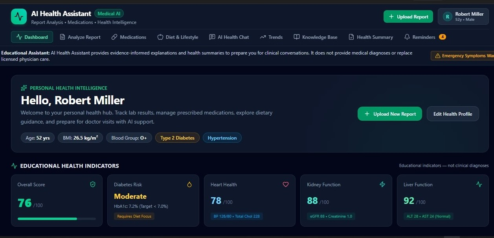
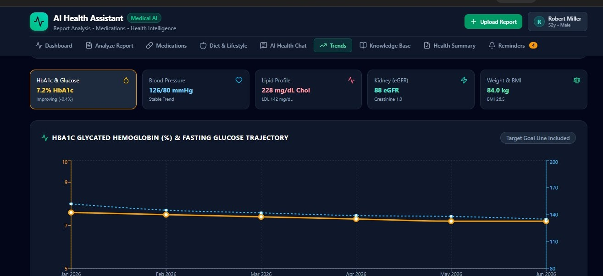
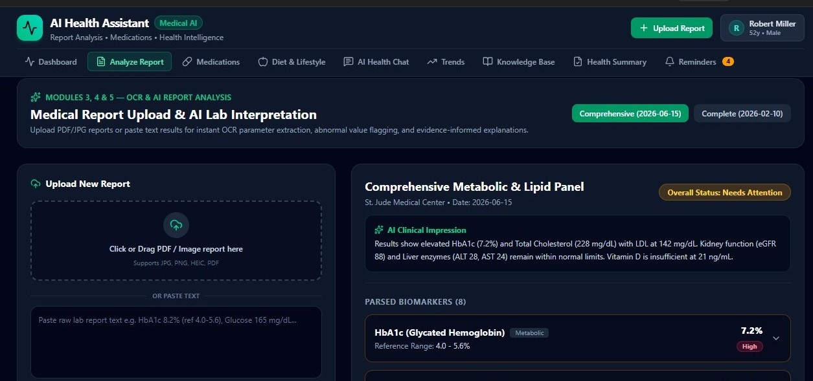
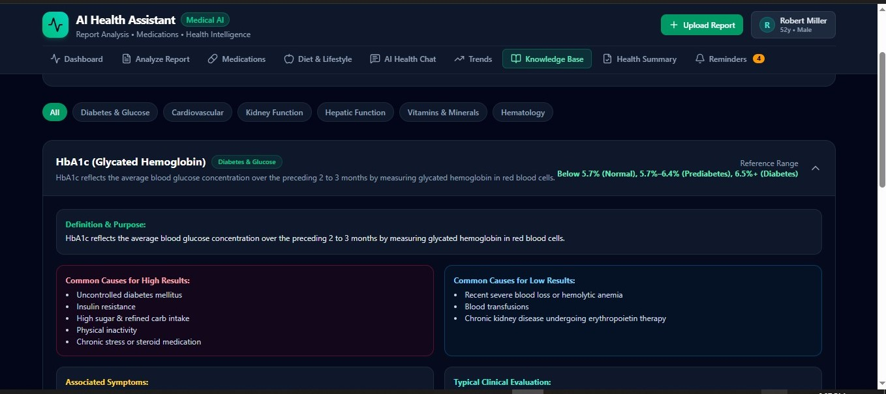
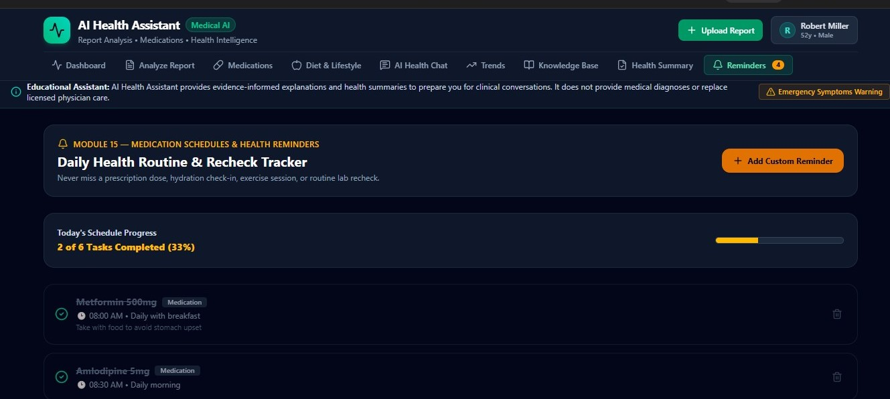
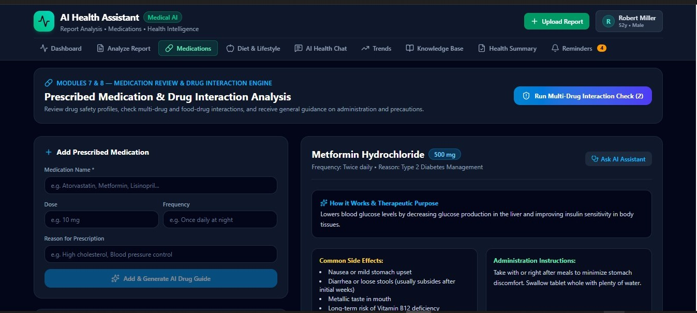

 🩺 AI Health Assistant

> A Google AI Studio-powered healthcare assistant that helps users understand medical reports, interpret laboratory results, review medications, receive evidence-informed nutrition guidance, track health progress, and prepare better conversations with healthcare professionals.

SCREENSHOTS:

           DASHBOARD


           TRENDS


           REPORT

 
           HEALTH CHAT


            KNOWLEDGE BASE


           REMINDERS



         MEDICATION


         SUMMARY


         PERSONALIZED NUTRITION


---

# 📌 Overview

**AI Health Assistant** is an AI-powered healthcare education and support application developed using the Google AI ecosystem.

The application uses **Google AI Studio and Gemini models** to help users understand health information from medical reports, laboratory results, medications, and lifestyle data.

The goal is to make healthcare information easier to understand while helping users have more informed discussions with healthcare professionals.

The application can:

- Analyze uploaded medical reports
- Extract laboratory values using AI-powered document understanding
- Explain abnormal laboratory results
- Provide medication education
- Suggest evidence-informed nutrition guidance
- Recommend healthy lifestyle improvements
- Track health information over time
- Generate personalized health summaries
- Answer health-related questions using Gemini AI

---

# ⚠️ Medical Disclaimer

AI Health Assistant is designed for **health education and informational support only**.

It is not a replacement for:

- Doctors
- Physicians
- Pharmacists
- Medical specialists

The AI assistant:

- ❌ Does not diagnose diseases
- ❌ Does not prescribe medication
- ❌ Does not recommend changing, stopping, or starting prescription medicines
- ❌ Does not replace professional medical advice

Users should always consult qualified healthcare professionals for medical decisions.

---

# 🌟 Project Vision

To build a responsible AI healthcare assistant powered by Google's AI technology that helps people understand their health information and communicate more effectively with healthcare providers.

---

# 🎯 Main Objectives

The application helps users:

✅ Upload medical reports  
✅ Understand laboratory values  
✅ Identify possible health concerns  
✅ Learn medication information  
✅ Understand possible drug interactions  
✅ Receive personalized food recommendations  
✅ Improve lifestyle habits  
✅ Monitor health trends  
✅ Generate health summaries  
✅ Ask health questions through AI  

---

# 🏗️ Powered By Google AI

This project is built around Google's AI ecosystem.

## Core AI Technology

### Google AI Studio

Used for:

- Gemini model development
- Prompt engineering
- AI testing
- Model experimentation
- Healthcare assistant behavior design

### Gemini AI Models

Used for:

- Medical report explanation
- Natural language conversations
- Health education
- Medication explanations
- Nutrition recommendations
- Personalized summaries

### Google Cloud AI Services

Used for:

- Document processing
- OCR extraction
- AI-powered analysis workflows

---

# 🧩 Application Modules

---

# 1. User Authentication

Features:

- Email login
- Google login
- Phone authentication
- Password recovery
- Multi-factor authentication (future)

User profile includes:

- Name
- Age
- Gender
- Height
- Weight
- Blood group
- Country
- Medical conditions
- Allergies
- Emergency contact

---

# 2. Health Profile Management

The application collects health information:

## Personal Data

- Age
- Gender
- Weight
- Height
- BMI
- Blood group

## Medical History

- Diabetes
- Hypertension
- Heart disease
- Kidney disease
- Liver disease
- Thyroid disorders
- Asthma
- Cancer history
- Family history

## Lifestyle Information

- Exercise frequency
- Sleep hours
- Stress level
- Water intake
- Smoking
- Alcohol usage

## Medication Information

- Current medicines
- Drug allergies
- Food allergies

---

# 3. Medical Report Upload

Supported formats:

- PDF
- JPG
- PNG
- HEIC

Supported medical documents:

- CBC
- HbA1c
- Lipid profile
- Liver function tests
- Kidney function tests
- Vitamin D
- Vitamin B12
- Iron profile
- Thyroid tests
- Urine analysis
- Electrolytes
- Hormone reports
- COVID reports
- Radiology summaries

---

# 4. AI Medical Report Understanding

Gemini AI analyzes reports and explains:

- Test purpose
- Meaning of values
- Normal ranges
- Possible reasons for abnormal results
- Lifestyle considerations
- Questions to discuss with doctors
- Possible follow-up discussions

Example:


Test:
HbA1c

Result:
8.2%

Reference:
4.0 - 5.6%

Interpretation:
The value is above the provided reference range.
It may be associated with changes in blood sugar control.
Discuss this result with your healthcare provider.


---

# 5. Medical Knowledge Assistant

The AI provides educational explanations for:

## Blood Tests

- WBC
- RBC
- Hemoglobin
- Platelets
- MCV
- MCH
- MCHC

## Diabetes

- HbA1c
- Fasting glucose
- Random glucose

## Cholesterol

- HDL
- LDL
- Triglycerides

## Kidney Function

- Creatinine
- Urea
- eGFR

## Liver Function

- ALT
- AST
- Bilirubin

## Vitamins

- Vitamin D
- Vitamin B12
- Ferritin

## Thyroid

- TSH
- T3
- T4

Each explanation includes:

- Definition
- Normal ranges
- Possible causes
- Symptoms
- General evaluation
- Lifestyle considerations

---

# 6. Medication Education Assistant

Users can enter:

- Medicine name
- Dose
- Frequency
- Duration
- Reason

Gemini explains:

- Common uses
- Possible side effects
- General usage information
- Food interactions
- Alcohol considerations
- Storage information
- Monitoring information

The AI does not:

- Change medication doses
- Stop medications
- Start new medications

---

# 7. Drug Interaction Analysis

The system can review medicines such as:


Metformin
Amlodipine
Atorvastatin


The AI checks:

- Possible interactions
- Food interactions
- Alcohol interactions
- Kidney considerations
- Liver considerations
- Pregnancy considerations

Users are advised to consult healthcare professionals for important concerns.

---

# 8. Nutrition Guidance

Gemini generates personalized food suggestions based on:

- Medical history
- Laboratory results
- Weight
- Age
- Activity level
- Health goals

Examples:

## Diabetes Support

Recommended:

- Vegetables
- Whole grains
- Beans
- Lentils
- Fish
- Eggs
- Nuts

Limit:

- Sugary drinks
- Highly processed foods

---

## Cholesterol Support

Recommended:

- Oats
- Olive oil
- Fish
- Nuts
- Vegetables

Limit:

- Fried foods
- Processed meats

---

# 9. Lifestyle Coach

Provides general wellness guidance:

- Exercise
- Walking plans
- Weight management
- Sleep improvement
- Hydration
- Stress management
- Smoking cessation resources
- Alcohol moderation

---

# 10. AI Health Chat

Users can ask:


Why is my creatinine high?

Can I eat bananas?

Why did my doctor prescribe atorvastatin?

How can I improve my HbA1c?

What foods contain vitamin D?


Gemini responds with:

- Clear explanations
- Educational information
- Uncertainty awareness
- Professional guidance reminders

---

# 11. Health Progress Tracking

Tracks:

- Weight
- BMI
- Blood pressure
- HbA1c
- Glucose
- Cholesterol
- Vitamin levels
- Kidney function
- Liver function

Displays:

- Weekly trends
- Monthly trends
- Yearly trends
- Graphs
- Progress summaries

---

# 12. Health Dashboard

Provides educational indicators:

- Overall wellness score
- Diabetes risk indicator
- Heart health indicator
- Kidney health indicator
- Liver health indicator
- Nutrition score
- Activity score
- Sleep score
- Hydration score
- Stress score

⚠️ These scores are educational indicators, not medical diagnoses.

---

# 13. AI Health Summary Generator

Creates:

- One-page health summary
- Abnormal result explanation
- Medication information
- Nutrition suggestions
- Lifestyle guidance
- Doctor discussion questions

---

# 14. Notifications

Future support:

- Medication reminders
- Water reminders
- Exercise reminders
- Lab reminders
- Doctor appointment reminders
- Sleep reminders

---

# 🤖 AI Safety Principles

The Gemini-powered assistant follows responsible healthcare AI practices.

The AI should:

✔ Explain information clearly  
✔ Use cautious language  
✔ Mention uncertainty  
✔ Encourage professional consultation  

The AI should never:

❌ Diagnose with certainty  
❌ Prescribe medicine  
❌ Replace doctors  

---

# 🛠 Technology Stack

## AI Platform

- Google AI Studio
- Gemini API
- Gemini Models

## Mobile Application

- Flutter

## Backend Services

- Google Cloud Services

## Database

- Firebase Firestore

## Authentication

- Firebase Authentication

## File Storage

- Firebase Storage

## Document Processing

- Google Cloud Vision
- Google Document AI

## Notifications

- Firebase Cloud Messaging

## Analytics

- Firebase Analytics

## Hosting

- Firebase Hosting
- Google Cloud Run

---

# 📂 Project Structure


AI-Health-Assistant/

│
├── app/
│ └── flutter_application/
│
├── backend/
│
├── ai/
│ ├── prompts/
│ ├── gemini-config/
│ └── knowledge-base/
│
├── firebase/
│
├── docs/
│
└── README.md


---

# 🚀 Development Roadmap

## Phase 1 — MVP

Completed foundation:

- User authentication
- Health profile
- Report upload
- AI report analysis
- Medication education
- Basic nutrition guidance

---

## Phase 2

Planned:

- Drug interaction checker
- AI chat assistant
- Progress tracking
- Health dashboard
- Notifications

---

## Phase 3

Future:

- Doctor portal
- Wearable integration
- Voice assistant
- Multi-language support
- Family health profiles
- Vaccination tracking
- Appointment management
- Electronic health record integration

---

# 🔐 Privacy & Security

The application should follow:

- Secure authentication
- Encrypted communication
- User consent
- Responsible AI usage
- Data protection principles

---

# 🤝 Contributing

Contributions are welcome.

1. Fork the repository

2. Create a feature branch:

```bash
git checkout -b feature/new-feature
Commit changes:
git commit -m "Add new feature"
Push:
git push origin feature/new-feature
